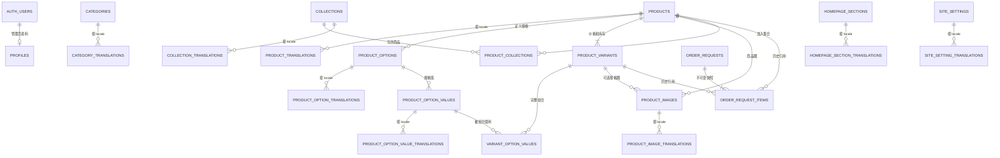

# Happy Beans 数据模型与权限基线

> 状态：Phase 3 数据基线、管理员审计、商品/订单流程、Phase 9 首页受控配置与 Phase 12 英文扩展均已在本地完成；数据库已从零重建，203 个 pgTAP 断言通过。
>
> 迁移：全部正式历史位于 `supabase/migrations/`；本次英文扩展为 `20260715191638_phase_12_english_storefront.sql`。
> 本地数据：`supabase/seed.sql`（仅 `DEMO-*` 开发数据）

## 1. 设计边界

- 第一版只有 CAD，不包含支付、自动税费、复杂运费、多币种或顾客账号。
- 商品、分类、集合、规格名称、规格值、商品图片替代文字、首页模块和站点设置使用基础表与 translation 表分离；顾客端启用 `en` 与 `zh`，后台界面保持中文并成对录入两种语言。
- 每个商品至少有一个 `product_variants` 行。无可选规格商品使用一个不关联 `variant_option_values` 的 variant。
- 订单数据是“订单请求”，直接 Data API 不允许游客提交；Phase 8 必须通过服务端事务重新读取商品、variant、价格与库存后写入。
- 初始 Phase 3 不包含管理 UI、公开商城、订单 API、认证页面或邮件；这些能力已由后续 Phase 的独立 migration 和应用层实现补充。

## 2. 关系概览



## 3. 表与职责

| 范围 | 表 | 关键职责 |
|---|---|---|
| 管理员 | `profiles` | 与 `auth.users.id` 一对一；MVP 角色只能为 `admin`，Data API 不能修改 |
| 管理员审计 | `admin_audit_logs` | 记录受控管理员操作；只允许管理员追加自己的 actor 记录，不可更新或删除 |
| 分类 | `categories`, `category_translations` | slug、显隐、排序与 locale 内容 |
| 商品 | `products`, `product_translations` | 草稿/发布/归档、发布时间、推荐状态与 locale 内容 |
| 灵活规格 | `product_options`, `product_option_translations`, `product_option_values`, `product_option_value_translations` | 任意规格名称和值；内部 key 不随语言变化 |
| Variant | `product_variants`, `variant_option_values` | 每个完整组合独立 SKU、CAD 价格、原价、库存、启用状态和活动时间 |
| 图片 | `product_images` | 只保存 private Storage 路径；可关联商品或同商品的具体 variant |
| 集合 | `collections`, `collection_translations`, `product_collections` | `new`、`featured`、`sale` 及手动排序 |
| 订单请求 | `order_requests`, `order_request_items` | 联系/履约信息、状态，以及标题、规格、SKU、价格、数量和图片路径快照 |
| 首页 | `homepage_sections`, `homepage_section_translations`, `site_settings`, `site_setting_translations` | 10 类受控模块、显隐、顺序、语言无关选品配置与 locale 结构化内容 |
| 商品图片文案 | `product_images`, `product_image_translations` | Storage 路径与排序语言无关；替代文字按 locale 保存 |
| 站点 | `site_settings` | 店铺联系信息、自取/本地配送开关和订单请求说明；保持单例 |

Phase 4 已通过独立 migration 新增 `admin_audit_logs`：保存 actor、受控 action、可选 target 和经过限制的 JSON metadata，不保存密码、token、完整顾客输入或其他 secret。

## 4. 核心数据库不变量

### 4.1 规格与库存

- `product_variants (product_id, lower(sku))` 唯一，同商品 SKU 不区分大小写重复。
- 事务提交前，约束触发器验证每个 variant 恰好选择该商品每个 option 的一个 value。
- 禁止把其他商品的 option value 关联到 variant。
- 同商品下两个 variant 的完整 option value 集合不能相同。
- 无 option 商品只能存在一个空组合 variant。
- `price_cad > 0`、`stock_qty >= 0`；`compare_at_price_cad` 必须高于现价。

这组验证使用 deferred constraint trigger，Phase 5B 必须在一个数据库事务中创建或变更 option、value、variant 和组合关系，不能把不完整中间状态分成多个独立提交。

### 4.2 Translation

- 所有 translation 表以“实体外键 + locale”为复合主键。
- locale 格式受约束；语言无关的 SKU、价格、库存、图片和内部 key 不复制。
- 删除基础实体会级联删除翻译，不会产生孤立翻译。
- 英文前台的可见性是读取规则而非独立发布开关：商品必须具备英文商品翻译、全部当前规格名称和值翻译及全部图片英文替代文字；分类必须具备英文翻译。缺失时只从英文查询结果隐藏，中文不受影响。

## Phase 12 英文前台扩展

- `order_requests.request_locale` 只允许 `en` 或 `zh`，记录顾客提交请求时的语言；历史/默认值为 `en`。
- `admin_create_product`、`admin_update_product`、分类、规格、图片和首页保存 RPC 均以一个数据库事务同步保存 `zh` 与 `en`，避免只保存一半语言。
- `submit_order_request_localized` 仅授予 `service_role`，按 `request_locale` 重新读取并锁定公开商品数据，在订单 item 中保存对应语言的标题、规格和图片快照。原有金额、库存、限流与至少一项订单约束不变。
- `product_image_translations` 与 `site_setting_translations` 同其他公开 translation 表一样启用 RLS；游客只读满足公开实体条件的内容，管理员通过既有 Auth/RLS 写入。

### 4.3 订单请求快照

- 状态固定为 `new | contacted | confirmed | preparing | completed | cancelled`。
- 履约固定为 `pickup | local_delivery`；本地配送必须有邮编，电话偏好必须有电话。
- `quantity > 0`、`unit_price_snapshot > 0`，每行金额必须等于单价乘数量。
- item 的 `variant_id` 必须属于其 `product_id`。
- 事务提交前，订单必须至少有一个 item，`subtotal_snapshot` 必须等于所有 item 快照合计。
- `final_total` 若存在，必须等于小计加可选配送费和税费。
- 商品默认采用归档保留历史；管理员也可受控永久删除尚未产生订单引用的草稿或归档商品。已发布商品必须先下架，订单 item 对商品和 variant 的限制删除继续保证历史引用不失效。

Phase 8 仍需实现受控服务端事务和权威重查；本模型不把浏览器金额当作可信输入。

Phase 8 已通过正式 migration 完成该受控事务：请求提交只能由 server-only service client 调用 `submit_order_request`，函数在同一数据库事务内锁定并重查公开商品、有效 variant、库存和当前价格，然后写入 `order_requests` 与不可变 `order_request_items` 快照。浏览器不能直接 INSERT 订单表，也不能把标题、SKU、价格或库存作为可信输入。

### 4.4 邮件交付状态

`order_request_emails` 为每个请求固定创建两行：`owner_notification` 与 `customer_confirmation`。

- 状态：`pending | sending | sent | failed`。
- 记录尝试次数、最后尝试时间、成功时间、provider message id 和最多 300 字符的失败摘要。
- RLS 只允许管理员读取；应用通过 server-only service client 更新发送结果。
- 邮件状态属于请求之后的附属交付状态，失败不会影响已提交的请求与 items 快照。

### 4.5 基础限流数据

`private.order_request_rate_events` 位于不暴露的 `private` schema，仅保存 HMAC 后的 IP/email 摘要、是否接受、关联请求和时间。它不保存原始 IP 或原始邮箱，也不向 `anon` / `authenticated` 暴露。

## 5. 索引

- 公开商品：`products(status, published_at desc)` 的 published partial index。
- variant：商品/启用状态索引，以及同商品大小写不敏感 SKU 唯一索引。
- 规格：同商品 option key、同 option value key 唯一索引；所有反向外键查询均有索引。
- 图片：商品/排序与 variant 索引。
- 集合：集合/排序索引。
- 订单后台：状态/创建时间、item 的订单/商品/variant 索引。
- 首页：启用状态/排序索引。

## 6. 权限矩阵

| 数据或操作 | `anon` | 普通 `authenticated` | `profiles.role = admin` |
|---|---|---|---|
| 已发布且发布时间已到的商品、翻译、规格、有效 variant | 读 | 读 | 全部读写 |
| 草稿/归档商品与未公开内容 | 无 | 无 | 全部读写 |
| 可见分类、集合、启用首页模块、站点公开设置 | 读 | 读 | 全部读写 |
| SKU、CAD 价格和规格级库存写入 | 无 | 无 | 允许 |
| `profiles` | 无 grant | RLS 返回空 | 只读；任何 Data API 身份均不能写角色资料 |
| 订单请求与 item | 无 grant | RLS 返回空 | 读取订单与 item；只允许更新订单请求状态/后台字段 |
| 订单请求直接 insert | 无 | 无 | 无；仅 server-only `service_role` 可调用受控事务 RPC |
| 邮件交付状态 | 无 | RLS 返回空 | 只读；发送结果由 server-only 邮件模块更新 |
| Storage 已登记的已发布商品图 | 读 | 读 | 读 |
| Storage 上传/替换/删除 | 无 | 无 | 允许，但受 bucket、路径、商品 ID、扩展名、MIME 和大小限制 |
| 管理员审计日志 | 无 grant | RLS 返回空且不可写 | 只读并仅可追加自己的 actor 记录；不可更新或删除 |

管理员判断统一使用未暴露的 `private.is_admin()`：它以 `auth.uid()` 查询 `profiles`，不读取用户可修改的 `user_metadata`。所有 `public` 表均启用 RLS；因 2026 年 Supabase 新项目不再自动暴露新表，migration 对 `anon`/`authenticated` 使用显式最小 `GRANT`。

## 7. Storage

- Bucket：`product-images`，private。
- 单文件上限：10 MiB。
- MIME：`image/jpeg`、`image/png`、`image/webp`。
- 路径：`products/<product-uuid>/<generated-file-name>.(jpg|jpeg|png|webp)`。
- 游客下载要求存在对应 `product_images.storage_path`，且商品已发布；variant 专属图还要求 variant 启用。
- 管理员写入同时检查身份、bucket、商品 UUID 目录、商品存在性和扩展名；bucket 层检查 MIME 与大小。

## 8. Seed

`supabase/seed.sql` 使用固定 UUID 和 upsert，可重复执行。它包含：

- 款式 + 颜色：4 个马克杯 variant。
- 尺寸：2 个地毯 variant。
- 无 option：1 个摆件 variant。
- `zh`/`en` translation 结构、`new`/`featured`/`sale` 集合、启用/禁用首页模块和站点设置。

所有商品 SKU 均以 `DEMO-` 开头，联系邮箱使用 `example.invalid`；没有测试管理员、密码、真实顾客资料或真实图片。全新 reset 会先跑 migration，再跑 seed。

## 9. 数据库测试与当前结果

| 测试 | 断言数 | 覆盖 | 当前结果 |
|---|---:|---|---|
| `001_schema_constraints.test.sql` | 26 | 表/RLS、三类规格、翻译唯一性、SKU/价格/库存、完整与重复组合、订单快照、Storage bucket | 通过（26/26） |
| `002_rls_permissions.test.sql` | 24 | `anon`、普通 Auth、管理员的商品、库存、订单、profiles 与 Storage 权限 | 通过（24/24） |

已实际执行的命令：

- `npm run supabase:start`：通过，本地 Supabase 服务成功启动。
- `npm run db:reset`：通过，migration 与 seed 均从空数据库成功应用。
- `npm run db:test`：通过，2 个文件、50 个断言全部成功。
- `npm run db:lint`：通过，`No schema errors found`。
- `npm run db:advisors`：通过，安全与性能检查均为 `No issues found`。
- `npm run lint`、`npm run typecheck`、`npm test`、`npm run build`：全部通过。

后续修改数据库时按顺序复验：

```powershell
npm.cmd run supabase:start
npm.cmd run db:reset
npm.cmd run db:test
npm.cmd run db:lint
npm.cmd run db:advisors
```

公开读取与管理员全量读取使用按角色合并的 SELECT 策略；管理员 INSERT、UPDATE、DELETE 分开定义，避免多条 permissive SELECT 策略重叠。上述完成条件已于 2026-07-13 全部满足。

## 10. Phase 4 审计迁移

- 迁移：`supabase/migrations/20260713162320_phase_4_admin_audit.sql`。
- `admin_audit_logs.actor_user_id` 外键指向 `auth.users.id`，删除仍有审计记录的用户前必须先按受控保留策略处理日志。
- `action` 和 target 格式受数据库约束；`metadata` 必须是 JSON object。
- RLS 和表级 GRANT 双重限制游客、普通 Auth 用户与管理员权限。
- `003_admin_audit_permissions.test.sql` 新增 10 个断言；当前数据库合计 60/60 个 pgTAP 断言通过。

## 11. 官方依据（2026-07-13 核对）

- [Supabase CLI 本地开发](https://supabase.com/docs/guides/local-development/cli/getting-started)
- [Schema migrations](https://supabase.com/docs/guides/local-development/overview)
- [Seed](https://supabase.com/docs/guides/local-development/seeding-your-database)
- [RLS](https://supabase.com/docs/guides/database/postgres/row-level-security)
- [数据库测试与 pgTAP](https://supabase.com/docs/guides/local-development/testing/overview)
- [Storage access control](https://supabase.com/docs/guides/storage/security/access-control)
- [Storage bucket 限制](https://supabase.com/docs/guides/storage/buckets/fundamentals)
- [2026 新表不再自动暴露到 Data API](https://supabase.com/changelog/45329-breaking-change-tables-not-exposed-to-data-and-graphql-api-automatically)

## 12. Phase 5A 原子管理函数

迁移 `supabase/migrations/20260713184334_phase_5a_catalog_admin_functions.sql` 没有新增业务表，也没有改变现有 RLS 可见性。它新增：

- 商品基础记录 + translation + 审计的原子创建和更新。
- 只复制基础内容、且重置为草稿的商品复制。
- 发布、下架、归档和恢复状态操作。
- 分类基础记录 + translation + 审计的原子创建和更新。

6 个函数均为 `security invoker`，空 `search_path`，只向 `authenticated` 授予执行权；函数内和底层 RLS 都复核管理员。`004_phase_5a_catalog_admin.test.sql` 增加 20 个断言，当前数据库总计 80/80 个断言通过。

Phase 6 已根据确认结论采用多分类模型：`product_categories(product_id, category_id, sort_order)` 连接商品与分类。同一商品可属于多个分类，同一分类也可包含多个商品；复合主键阻止重复归属，级联删除只清理连接记录。公开读取仅返回“已发布商品 + 可见分类”的连接，管理员可读取和维护全部连接。

`admin_save_product_categories(uuid, uuid[])` 使用 `security invoker` 在单一事务内替换商品分类归属、拒绝超过 20 个分类或不存在的 ID，并写入管理员审计记录。`anon` 没有该函数执行权。

## 13. Phase 5B 规格快照保存

迁移 `supabase/migrations/20260713190629_phase_5b_variant_admin.sql` 新增 `admin_save_product_variants(uuid, jsonb)`：

- 管理员一次提交商品的完整 option、value、笛卡尔 variant 和 value 关联，函数在同一事务内新增、更新和删除差异并写入审计记录。
- 新 option/value 使用 UUID 派生的语言无关内部 key，中文名称和标签继续保存到 translation 表；公开中文内容不硬编码进内部 key。
- 函数为 `security invoker`，先复核 `private.is_admin()`，只向 `authenticated` 授予执行权，底层表仍受既有 RLS 约束。
- 每次保存立即执行 deferred 组合约束，保证函数返回成功前已经验证完整组合、跨商品 value 和重复组合。
- 规格组合必须完整覆盖笛卡尔积；不销售的组合通过 `is_active = false` 保留，而不是从矩阵中缺失。
- 数据库继续最终拒绝大小写不敏感的同商品重复 SKU、`price_cad <= 0`、原价不高于现价和负库存。
- 单次配置限制为最多 8 个 option、每个 option 最多 50 个 value、最多 500 个组合，防止后台误操作生成不可管理的矩阵。

`005_phase_5b_variant_admin.test.sql` 新增 19 个断言，覆盖管理员边界、猫狗茶杯 4 组合、尺寸地毯 2 组合、无规格默认组合、组合禁用、独立价格库存、重复组合、重复 SKU、负库存和无效价格。

## 14. Phase 5C 图片与运营状态函数

- `admin_register_product_images`：批量登记已经过服务器核验的 Storage 对象，限制单批 20、单商品 100，并检查路径、图片 ID、替代文字和同商品 variant。
- `admin_save_product_images`：一次保存完整图片顺序、替代文字和规格关联；传入集合必须与数据库当前集合完全一致。
- `admin_delete_product_image` / `admin_restore_product_image`：支持 Server Action 的删除与失败补偿流程。
- `admin_save_product_operations`：保存商品推荐状态与新品发布时间。
- `admin_save_product_variants`：在 Phase 5B 原子规格保存基础上增加规格级特价起止时间；数据库约束禁止无原价的特价窗口。

`006_phase_5c_product_media_operations.test.sql` 新增 21 个断言，覆盖管理员边界、批量图片登记、排序/封面、规格关联、跨商品拒绝、删除/恢复、推荐/新品状态、特价时间与无原价拒绝。当前数据库总计 120/120 个 pgTAP 断言通过。

## 15. 受控商品永久删除

`admin_delete_product` 是商品永久删除的唯一数据库入口。它使用 `security invoker` 和现有管理员 RLS，只允许删除草稿或已归档商品；已发布商品以及被 `order_request_items` 引用的商品会被明确拒绝。事务会级联清理商品翻译、规格、库存、分类/集合关联和图片元数据，同时移除首页手动选品及相关图片引用，写入不可变审计记录，并返回 Storage 路径供 Server Action 通过 Storage API 永久清理对象。

## 16. Phase 9 首页受控配置

- 正式 migration：`20260714030708_phase_9_homepage_operations.sql`。
- 模块类型固定为公告条、Hero、热门分类、新品、推荐、特价、品牌故事、履约说明、FAQ 和联系 CTA；`section_type` 仍是数据库 enum，不能创建任意新模块。
- `settings_json` 只保存语言无关配置：已登记商品图片 ID、分类 ID、商品 ID、自动/手动选品方式和 1–8 显示数量。
- `homepage_section_translations.content_json` 保存按 locale 分离的受控结构化内容；当前只用于自取/配送两组说明和最多 5 组 FAQ，不接受任意 HTML/JavaScript。
- `admin_save_homepage(jsonb, jsonb)` 为 `security invoker` 原子 RPC：再次复核管理员、要求完整 10 模块、拒绝额外 key、重复排序、任意 CTA、无效 UUID/实体、超限数组、HTML 标记和错误 FAQ/履约 schema，并同步联系/履约站点设置与审计记录。
- 匿名用户只读取启用模块；普通 authenticated 用户不能保存；管理员读写仍受 Server Action、RLS 和 RPC 三层约束。
- `009_phase_9_homepage_operations.test.sql` 新增 12 个断言；当前 9 个数据库测试文件共 176/176 个断言通过。
