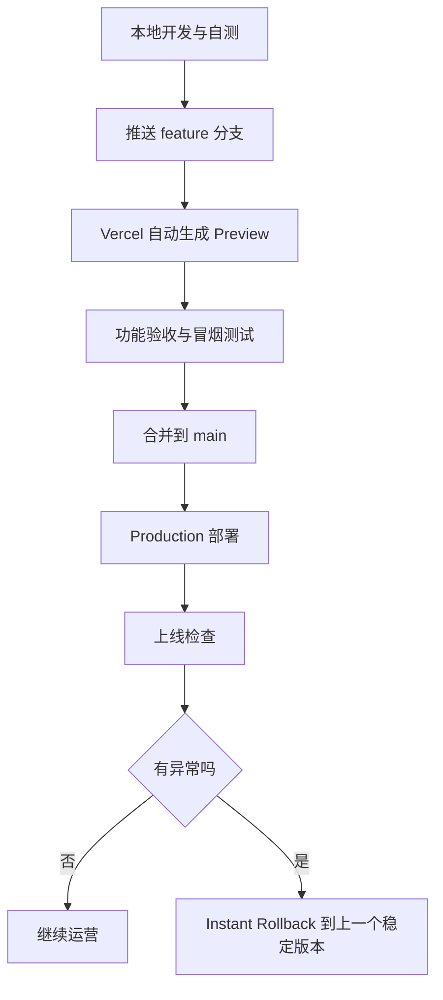
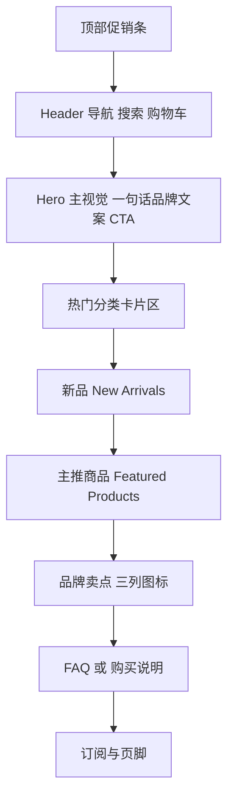
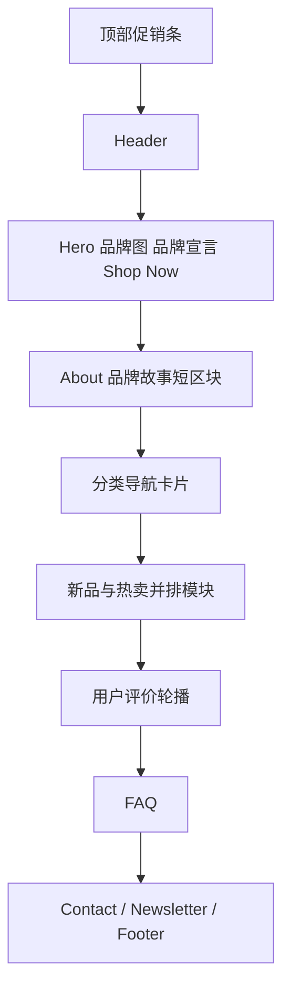
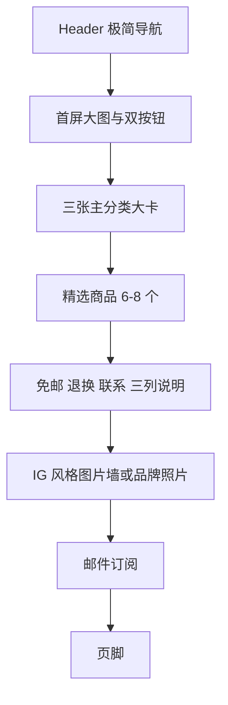

# 基于 Supabase 与 Vercel 的前后端电商展示网站分析报告

## 执行摘要

如果你的目标不是做一个“超级复杂的全功能商城”，而是做一个**视觉像样、能上架商品、能登录、能管理、能加购物车、能留出结账位**的电商/展示网站，那么“**Next.js + Supabase + Vercel + Codex 协助开发**”是很合适的方案。它和你给的两个参考站在能力层面是同一路数：都属于商品目录驱动、图片驱动、购物流程轻量、内容页不复杂的电商品牌站。两个参考站的公开页面都显示出典型 Shopify 风格能力，包括商品集合页、商品详情页、购物车/结账入口、地区/货币选择、邮件订阅和支付方式展示；这说明你要复刻的，不是一个 ERP 怪兽，而是一个**中小型品牌电商前台 + 轻后台**。citeturn21view1turn10view1turn12view0

从技术上看，推荐把 **Supabase 当作真正的后端中枢**：数据库、认证、存储、RLS 权限都放在 Supabase；把 **Next.js App Router** 当作前端和轻量 BFF；把 **Vercel** 当作部署与预览环境；把 **Codex** 当作“生成模块骨架、迁移 SQL、页面组件、API 路由和测试样例”的开发加速器。Supabase 官方已经给出 Next.js App Router 的 Auth/SSR 路线，Next.js 官方则把 App Router、Route Handlers、Metadata、Image、字体优化这些能力都收拢到了统一的现代工程模型里，Vercel 也原生支持 Git 触发的 Preview/Production 部署与快速回滚。citeturn14search5turn14search20turn15search0turn4search1turn4search0turn17search1turn22search1turn1search14

就交付策略而言，我建议你把项目拆成三层：**MVP 先做能卖/能展示**，第二阶段补细节和运营能力，第三阶段才接支付、自动订单流和更高级搜索。原因很简单：支付方式目前“未指定”，而支付、税费、退款、物流通知会把范围瞬间从“小商城”抬成“线上交易系统”。所以最稳妥的做法是：**MVP 先保留 checkout 占位页**，同时把订单、库存、用户、权限、图片、SEO、响应式这些基础打牢。这样即使后续换 Stripe、PayPal，甚至改成“下单咨询制”，数据库和前端骨架都不用大改。这个策略也更适合让 Codex 生成可控代码，而不是一上来让它给你端上一锅“功能很多但一碰就碎的魔法汤”。citeturn2search3turn2search6turn1search17turn15search15

如果是**一名开发者 + Codex 协助**，一个相对务实的估算是：**MVP 约 8–12 人日，完善阶段 4–7 人日，上线收尾 2–4 人日**。这不是因为代码写不出来，而是因为真正花时间的地方通常不在“写一个按钮”，而在**权限边界、图片处理、后台表单、部署环境、回滚演练、验收和交付文档**。Codex 能显著提速，但不能替你承担产品判断和上线责任。citeturn20search3turn20search15turn20search13

## 示例网站拆解

先说结论：**Cutie Pocket 更偏“IP/角色驱动的 Kawaii 商品站”，Wuli Home 更偏“家居生活方式驱动的温暖品牌店”**。前者的首页和导航明显围绕角色/IP、盲盒、毛绒、公仔、文具等分类组织，商品图和角色入口权重很高；后者则把“Shop by Category”“New Arrivals”“About Wuli Home”“FAQ”“Reviews”“Contact Us”都放在首页主线里，更像“品牌故事 + 生活方式商品”的混合型首页。citeturn10view0turn11view3turn10view1turn13view0

需要实话实说的一点是：这次研究环境能抓到公开页面结构、文本、商品标题、按钮文案、支付方式、购物流程入口，但**不能像设计审稿那样稳定读取最终渲染的 CSS、字号和真实像素级截图**。所以你下面看到的“色彩/字体/图片风格”判断，是基于公开页面内容、栏目组织、商品命名和图片 alt 文案做的**保守推断**，不是拿 Figma 尺子量出来的法医报告。别担心，这不影响你做项目决策，只影响我不想装神弄鬼地胡说具体字重。citeturn11view3turn13view0

| 维度 | Cutie Pocket | Wuli Home |
|---|---|---|
| 页面类型 | 首页、集合页、商品详情页、搜索、购物车、联系/政策页、地区/货币选择、邮件订阅都可见。citeturn10view0turn7view2turn10view4turn11view0 | 首页、Shop All、集合页、商品详情页、FAQ、Contact、Gift Wrapping、购物车、登录、地区/货币选择、邮件订阅都可见。citeturn10view1turn10view3turn9search0turn12view0 |
| 布局特征 | 首页先给导航与分类，再给 About、角色/IP 入口、New Arrivals、邮件订阅；集合页是典型商品网格；商品详情页是“图 + 价格 + 库存 + 数量 + 加购 + 推荐商品”。citeturn10view0turn11view3turn10view4 | 首页是更完整的品牌电商首页：Hero、分类入口、New Arrivals、About、用户评价、Popular Restocks、FAQ、Contact、订阅；Shop All 还带分类模块化入口。citeturn8view5turn13view0turn10view3 |
| 色彩/字体推断 | 品牌定位是 “kawaii / cute gifts”，并且分类围绕 Sanrio、Chiikawa、Rilakkuma 等角色，视觉应偏粉彩、轻甜、圆角、角色主导；字体策略大概率偏友好型无衬线，但公开抓取无法确认具体字族。citeturn0search0turn11view3 | 首页口号是“Creating cozy moments in every corner”，商品名大量出现 cherry blossom、bread、strawberry、creamy white、hand-painted，视觉气质明显更偏奶油、暖白、家居感；字体应偏简洁、温和、易读。citeturn7view1turn13view0turn9search1 |
| 图片风格 | 更偏**角色/IP 商品图**与抠图式商品陈列，角色入口和新品区都依赖商品图。citeturn11view3 | 更偏**生活方式家居静物 + 产品细节图片**，并辅以评论区商品图和情绪化文案。citeturn13view0turn9search1 |
| 交互要点 | 顶部有 Search、Account、Cart、Region；商品卡支持 Add/Choose；详情页显示剩余库存、数量增减、加购、推荐商品。citeturn8view0turn10view4 | 顶部有 Search、Log In、Cart；首页和集合页强调分类跳转；详情页显示库存状态、数量调节、加购、礼品包装、预计送达、评论；首页还有 FAQ 与 Contact 表单。citeturn8view4turn9search6turn12view3turn12view1turn12view0 |
| 购物流程 | 商品列表进入详情页，详情页加购物车，购物车为空时提示登录更快结账；公开页可见支付方式，但当前抓取未直接看到完整 checkout 页。citeturn10view4turn21view1 | 商品卡可 Add to cart/Choose options，购物车抽屉中直接显示 Check out；详情页还出现 “More payment options” 文案，说明结账入口可见。citeturn8view5turn9search2turn9search8 |
| 结账/支付是否可见 | 支付方式在页脚公开展示：Apple Pay、Google Pay、PayPal、Shop Pay、Visa 等；购物车提示注册用户结账更快。citeturn8view0turn21view1 | 购物车抽屉直接显示 Check out；页脚公开展示 Apple Pay、Google Pay、PayPal、Shop Pay、Visa 等多种方式。citeturn10view2turn12view0 |
| 响应式行为推断 | 有 “More”、搜索、账户、购物车、底部导航入口与重复菜单结构，说明站点至少实现了移动端导航/抽屉式流程；但本次未做真实多设备截图验证。citeturn11view1turn21view1 | 有抽屉购物车、重复菜单块、移动端式入口文案，以及“Choosing a selection results in a full page refresh”提示，说明站点考虑了小屏交互与选择器回流。citeturn10view1turn12view0 |

对你的项目而言，这两个站给出的产品信号很清楚：**你不需要“信息架构很重”的门户站，而需要“商品图驱动 + 分类可逛 + 购买路径短 + 后台可维护”的品牌站**。如果是给朋友做，我建议首页采用 **“品牌主视觉 + 分类入口 + 新品/推荐 + 评价/信任区 + CTA”** 的结构，这比一上来塞 20 个功能更像能卖货的网站。Wuli Home 的“About + Reviews + FAQ + Contact”组合很值得借；Cutie Pocket 的“角色/IP 快速入口 + 新品区 + 明确分类”很适合做商品导购。citeturn11view3turn13view0

## 功能范围与权限模型

在 Supabase 的访问模型里，前端直连数据库/存储时，真正关键的不是“页面有没有按钮”，而是**匿名用户 `anon`、登录用户 `authenticated`、后端高权限 `service_role`** 能分别碰到哪些表、哪些行。Supabase 官方明确把安全分成两层：一层是对象级可达性，另一层是 RLS 决定具体能读写哪些行。换句话说，按钮写得再漂亮，RLS 没写对，迟早翻车；RLS 写对了，前端就算手滑，也不容易把整个数据库端掉。citeturn1search17turn2search10

下面这张表把你要求的功能，按**必须 / 可选 / 未来扩展**拆开，并且把前端、后端、表结构与权限建议一起放进去。表里很多设计是“为快速上线而克制”的：比如库存先做**单字段库存 + 可选库存流水**，支付先做**checkout 占位**，订单先做**可落库的订单草稿/待支付状态**。这样最适合 Codex 分模块生成，也最不容易把开发范围炸成烟花。  

| 优先级 | 功能 | 前端范围 | 后端与接口 | Supabase 表结构与字段建议 | 权限规则 |
|---|---|---|---|---|---|
| 必须 | 商品管理 CRUD | 管理员商品列表、创建/编辑表单、图片排序、上下架开关 | Route Handler 或 Server Action 调用 Supabase；管理端用 service role 仅在服务端执行 | `products`：`id`、`slug`、`title`、`subtitle`、`description`、`price`、`compare_at_price`、`status`、`sku`、`stock_qty`、`cover_image_url`、`search_tsv`；`product_images`：`product_id`、`path`、`sort_order` | 管理员可增删改；游客/注册用户只能读 `published` |
| 必须 | 图片上传 | 管理后台拖拽上传、封面图、附图、预览、删除 | 上传到 Supabase Storage `product-images` bucket；写入 `product_images` | `product_images.path`、`alt_text`、`width`、`height`、`blur_data_url` 可选 | 管理员可上传/删改；前台读公开图片；若使用私有 bucket 则由签名 URL 控制 |
| 必须 | 库存 | 商品详情库存提示、售罄状态、管理员改库存 | 更新 `products.stock_qty`；如需审计再加流水 | `products.stock_qty`，可选 `inventory_movements`：`change_type`、`delta`、`note` | 管理员写；游客/注册用户只读 |
| 必须 | 用户注册/登录 | 登录页、注册页、Google 登录、邮箱密码登录、忘记密码 | Supabase Auth；SSR 用 cookie 模式 | `auth.users` + `profiles`：`id`、`email`、`display_name`、`avatar_url`、`role` | 游客可注册登录；用户改自己资料；管理员可查看用户列表 |
| 必须 | 管理员面板 | 仪表盘、商品表格、分类管理、库存编辑、订单查看 | 使用服务端鉴权 + `is_admin()` 辅助函数 | `profiles.role='admin'`；可选 `audit_logs` 记录关键操作 | 仅管理员可访问 |
| 必须 | 购物车 | 商品详情页加入购物车、购物车抽屉/页面、数量调整、删除 | 用户登录后存 DB；游客可先本地存储，登录后合并 | `carts`：`user_id`/`session_id`；`cart_items`：`cart_id`、`product_id`、`qty`、`unit_price_snapshot` | 游客只操作本地或匿名 session；注册用户只读写自己的 cart |
| 必须 | 结账占位 | `/checkout` 页面、订单摘要、收货信息表单、支付方式占位文案 | 先生成 `orders` 记录，`payment_status='unpaid'`；第三方支付未指定 | `orders`：`order_no`、`user_id`、`status`、`payment_status`、`payment_provider`、`shipping_name`、`shipping_phone`、`shipping_address_json`、`subtotal`、`shipping_fee`、`total`；`order_items` | 游客可提交询价/未登录占位，或要求登录后提交；管理员可查看全部订单 |
| 必须 | 搜索与分类 | 顶部搜索框、分类页、筛选 chips、分页/加载更多 | 初期用 Postgres FTS；中文/日文需要时可升级 PGroonga | `categories`、`product_categories`；`products.search_tsv` 或 `search_text` | 游客/注册用户读已发布商品；管理员全读写 |
| 必须 | 响应式页面 | 手机导航抽屉、2/3/4 列网格切换、移动端购物车可用 | 纯前端实现，必要时加 SSR 首屏数据 | 无新增表 | 所有人可访问公开页面 |
| 必须 | SEO 基础 | title/description、OG、sitemap、robots、商品详情 metadata | Next Metadata API + sitemap.ts + robots.ts | 可选 `site_settings` 保存站点默认 SEO 文案 | 游客可见；管理员可维护默认 SEO 配置 |
| 必须 | 图片优化 | 商品卡/详情页懒加载、裁剪、缩略图、占位图 | `next/image` + 远程域白名单；可写入图片尺寸元数据 | `product_images.width`、`height`、`blur_data_url` 可选 | 前台只读；管理员上传时写元数据 |
| 可选 | 用户资料页 | 我的资料、头像、我的订单 | `profiles`、`orders` | `profiles.phone`、`address_book` 可选 | 用户只能改自己；管理员可读 |
| 可选 | 用户评论/评分 | 商品评论区、评分星级、审核状态 | 评论审核 API | `reviews`：`rating`、`content`、`status`、`user_id`、`product_id` | 游客只读已审核评论；注册用户可发；管理员审核 |
| 可选 | 优惠码/横幅 | 首页促销条、优惠信息、活动标签 | 后台维护 banner/settings | `banners`、`site_settings` | 管理员写；前台读 |
| 可选 | Newsletter / 联系表单 | 订阅浮层、联系表单 | 可写入表或直接发邮件/Webhook | `newsletter_leads`、`contact_messages` | 游客可提交；管理员读 |
| 未来扩展 | 第三方支付 | Stripe Checkout / PayPal / 手工转账 | Webhook + 支付状态同步 | `orders.payment_intent_id`、`transactions` | 后台 webhook 写；用户只读自己订单 |
| 未来扩展 | 国际化/多币种 | 中英切换、货币切换 | 前端 i18n + 价格映射 | `product_translations`、`currencies` 可选 | 游客可读；管理员维护 |
| 未来扩展 | 更高级搜索 | 拼写纠错、中文/日文商品搜索、语义召回 | PGroonga 或混合搜索 | `products.search_tsv` / `pgroonga` 索引 | 公开搜索 |
| 未来扩展 | 自动库存流水/导入导出 | CSV 导入、批量上架、变更历史 | 批处理 API / 管理后台工具 | `inventory_movements`、导入任务表 | 仅管理员 |

这套功能分层和 Supabase 官方能力是对得上的：Auth 支持邮箱密码与社交登录，Google OAuth 需要配置 `openid`、`userinfo.email`、`userinfo.profile` 等范围；SSR 场景建议使用 `@supabase/ssr` 和 cookie 会话；Storage 与 RLS 可以一起工作；搜索可以先上 Postgres Full Text Search，后续如有中文/日文检索需求再升级到 PGroonga。Supabase 也会自动把同邮箱的多身份登录做 identity linking，这对“先邮箱注册、后面改用 Google 登录”的用户体验很有用。citeturn14search1turn14search7turn14search18turn2search0turn14search20turn14search0turn16search0turn16search2turn1search21

关于“结账/支付方式是否接入”，本报告按你的要求明确标注：**当前为“未指定”**。所以建议默认实现为两档：  
第一档，MVP 做 **checkout 占位页 + 订单草稿落库**；  
第二档，如果后续确定支付供应商，再接 **第三方 Hosted Checkout**。  
这比在需求未定的时候先做半吊子支付流要稳得多。嗯，别让项目一开始就陷入“支付还没定，但表已经乱飞”的经典悬疑剧。  

## 技术栈与项目结构

从当前官方文档看，最顺手、最不容易跟 Supabase/Vercel 打架的组合，是 **Next.js App Router + TypeScript + Tailwind CSS + shadcn/ui + Supabase JS/SSR + Vercel**。Next.js 文档已经把 App Router 定义为推荐的新路由体系，支持 Server Components、Route Handlers、Metadata、Image 优化和现代部署路径；Supabase 官方也提供了 Next.js 的快速开始和 Auth/SSR 指南；Vercel 则直接给出 Preview/Production 环境和回滚流程。citeturn1search3turn15search7turn2search16turn14search5turn22search1turn1search14

我建议的版本线如下。这里故意写“版本线”而不是每个 patch 号，因为你真正要锁的是**兼容边界**，不是为了显得专业去背包里揣一把毫无意义的版本尾号。  

| 组件 | 建议版本线 | 推荐理由 | 依据 |
|---|---|---|---|
| Node.js | **22.x LTS** 本地开发；Vercel 运行时也锁 22.x | Next.js 当前安装要求最低 20.9；Vercel 可用 20 / 22 / 24，虽然新项目默认 24.x，但锁 22.x 往往更稳，兼容性更保守 | citeturn3search0turn3search6 |
| Next.js | **16.x** | App Router、Metadata、Image、Route Handlers、Server Functions 路线成熟，文档最新 | citeturn3search4turn15search0turn4search1 |
| React | **19.2 跟随 Next.js 16 路线** | Next.js 16 官方升级文档已明确提到 App Router 使用 React 19.2 相关能力 | citeturn1search23 |
| TypeScript | **5.x** | Next.js 内建 TypeScript 支持，Codex 生成类型更稳 | citeturn3search11 |
| CSS | **Tailwind CSS 4.x** | 和 Next.js 配置直接、类名驱动适合快速复刻参考站视觉；对 Codex 生成 UI 很友好 | citeturn18search9turn18search20 |
| 组件层 | **shadcn/ui** | 不是黑盒组件库，而是可复制进项目的组件分发方式，适合边生成边定制 | citeturn18search2 |
| Supabase SDK | **`@supabase/supabase-js` 2.x** | 官方 SSR 指南与 Next.js 快速开始都基于它 | citeturn2search0turn2search16 |
| Supabase SSR | **`@supabase/ssr` 最新稳定版** | SSR/Auth cookie 模式的官方推荐包 | citeturn2search0turn14search9 |
| 搜索 | **Postgres FTS 起步；PGroonga 作为中日文升级选项** | 起步成本低；如数据和语言复杂度提升再升级 | citeturn16search0turn16search2 |
| 部署 | **Vercel Git 部署 + Preview 环境** | PR 自动预览，生产回滚快，适合前后端一体 Next 项目 | citeturn22search1turn5search3turn1search14 |

样式层我默认推荐 **Tailwind + shadcn/ui**，而不是 Chakra UI。原因不是 Chakra 不行，而是**你现在这类项目更需要“快速复刻、快速改样式、方便 Codex 按 className 直接生成”**。参考站都属于图片驱动、卡片驱动、Banner 驱动页面，Tailwind 在这类任务上更像手里一把螺丝刀，而不是一台需要先培训一小时的高档电钻。citeturn18search7turn18search2

项目目录建议如下：

```text
my-shop/
├─ app/
│  ├─ (store)/
│  │  ├─ page.tsx                     # 首页
│  │  ├─ products/
│  │  │  ├─ page.tsx                 # 商品列表/搜索
│  │  │  └─ [slug]/page.tsx          # 商品详情
│  │  ├─ categories/[slug]/page.tsx  # 分类页
│  │  ├─ cart/page.tsx               # 购物车
│  │  ├─ checkout/page.tsx           # Checkout 占位
│  │  ├─ login/page.tsx
│  │  ├─ register/page.tsx
│  │  └─ account/
│  │     ├─ page.tsx
│  │     └─ orders/page.tsx
│  ├─ admin/
│  │  ├─ page.tsx
│  │  ├─ products/page.tsx
│  │  ├─ products/new/page.tsx
│  │  ├─ products/[id]/page.tsx
│  │  ├─ categories/page.tsx
│  │  └─ orders/page.tsx
│  ├─ api/
│  │  ├─ products/route.ts
│  │  ├─ products/[id]/route.ts
│  │  ├─ upload/route.ts
│  │  ├─ cart/route.ts
│  │  ├─ checkout/route.ts
│  │  └─ webhooks/
│  │     └─ payment/route.ts         # 未来支付接入
│  ├─ layout.tsx
│  ├─ robots.ts
│  ├─ sitemap.ts
│  └─ globals.css
├─ components/
│  ├─ ui/
│  ├─ layout/
│  ├─ product/
│  ├─ cart/
│  ├─ auth/
│  └─ admin/
├─ lib/
│  ├─ supabase/
│  │  ├─ browser.ts
│  │  ├─ server.ts
│  │  └─ middleware.ts
│  ├─ auth.ts
│  ├─ permissions.ts
│  ├─ validators.ts
│  ├─ seo.ts
│  └─ utils.ts
├─ db/
│  ├─ migrations/
│  └─ seeds/
├─ public/
│  ├─ favicon.ico
│  └─ og/
├─ tests/
│  ├─ unit/
│  ├─ integration/
│  └─ e2e/
├─ scripts/
│  ├─ seed.ts
│  ├─ sync-env.sh
│  └─ smoke-check.sh
├─ AGENTS.md
├─ package.json
├─ postcss.config.mjs
├─ next.config.ts
└─ README.md
```

运行时建议也要分清楚：  
**公开商品读取**尽量走 Server Components 或服务端 Supabase 查询；  
**后台 CRUD 和上传**走 Route Handlers 或 Server Actions，但凡涉及 `service_role` 的逻辑都只放服务端；  
**未来支付 Webhook、定时清理、第三方回调**，如果更靠近数据库逻辑，可以考虑 Supabase Edge Functions；如果更靠近 Next 项目本身，也可以放 Vercel Node Runtime。Supabase Edge Functions 使用 Deno，Vercel 则同时支持 Node.js Runtime 和 Edge Runtime。对于这个项目，**优先少造分布式脑裂**，先把重逻辑放一边。citeturn15search0turn15search23turn22search17turn3search2turn3search3turn2search3

## Supabase 数据模型建议

Supabase 的强项是：你拿到的是**完整 Postgres**，不是简化版“玩具后端”。这意味着你可以用外键、索引、RLS、数据库函数、全文检索，甚至扩展。官方文档也明确说明，Supabase 的 Auth、Storage、Realtime 都是建在 Postgres 之上的；Storage 元数据在 `storage` schema 里，但应通过 API 操作，不要直接手改底层表。对客户端访问来说，RLS 是核心；对搜索来说，Postgres FTS 足够做第一阶段；如果商品标题/描述里会混进较多中文、日文，可以把 PGroonga 作为进阶搜索方案。citeturn16search5turn14search17turn2search22turn2search6turn16search0turn16search2

建议在 `public` schema 中以如下表为主。为了便于你给 Codex 生成迁移 SQL，我把字段、类型、索引、外键、示例数据和 RLS 摘要都放在一张表里。这里的设计重点是：**少表但够用、可扩展但不炫技**。

| 表名 | 字段 | 类型 | 索引 | 外键 | 示例数据 | RLS 策略摘要 |
|---|---|---|---|---|---|---|
| `profiles` | `id`, `email`, `display_name`, `avatar_url`, `role`, `created_at`, `updated_at` | `uuid`, `text`, `text`, `text`, `text`, `timestamptz` | PK(`id`), idx(`role`), unique(`email`) | `id -> auth.users.id` | `('b7...','leo@example.com','Leo',null,'admin',...)` | 用户可 `select/update` 自己；管理员可读全表；仅服务端可改他人角色 |
| `categories` | `id`, `slug`, `name`, `description`, `sort_order`, `is_visible`, `created_at` | `uuid`, `text`, `text`, `text`, `int`, `bool`, `timestamptz` | PK, unique(`slug`), idx(`sort_order`) | - | `('c1','mugs','马克杯', '可爱陶瓷杯', 10, true, ...)` | 游客/注册用户只能读 `is_visible=true`；管理员全 CRUD |
| `products` | `id`, `slug`, `title`, `subtitle`, `description`, `price`, `compare_at_price`, `currency`, `sku`, `status`, `stock_qty`, `cover_image_url`, `search_text`, `search_tsv`, `created_by`, `created_at`, `updated_at` | `uuid`, `text`, `text`, `text`, `text`, `numeric(10,2)`, `numeric(10,2)`, `text`, `text`, `text`, `int`, `text`, `text`, `tsvector`, `uuid`, `timestamptz`, `timestamptz` | PK, unique(`slug`), unique(`sku`), idx(`status`), idx(`stock_qty`), GIN(`search_tsv`) | `created_by -> profiles.id` | `('p1','cute-bunny-mug','兔子马克杯',...,'published',12,...)` | 游客/注册用户只读 `status='published'`；管理员全 CRUD |
| `product_images` | `id`, `product_id`, `path`, `public_url`, `alt_text`, `sort_order`, `width`, `height`, `created_at` | `uuid`, `uuid`, `text`, `text`, `text`, `int`, `int`, `int`, `timestamptz` | PK, idx(`product_id`,`sort_order`) | `product_id -> products.id` | `('img1','p1','products/p1/main.webp','https://...','兔子马克杯主图',1,1200,1200,...)` | 前台只读属于已发布商品的图片；管理员全 CRUD |
| `product_categories` | `product_id`, `category_id` | `uuid`, `uuid` | PK(`product_id`,`category_id`) | `product_id -> products.id`, `category_id -> categories.id` | `('p1','c1')` | 读规则跟 product/category 一致；管理员可维护关联 |
| `carts` | `id`, `user_id`, `session_id`, `status`, `created_at`, `updated_at` | `uuid`, `uuid`, `text`, `text`, `timestamptz`, `timestamptz` | PK, idx(`user_id`), idx(`session_id`) | `user_id -> profiles.id` | `('cart1','u1',null,'active',...)` | 登录用户仅访问自己的购物车；游客购物车可先存本地，若落库则按 `session_id` 控制且尽量通过服务端 |
| `cart_items` | `id`, `cart_id`, `product_id`, `qty`, `unit_price_snapshot`, `created_at`, `updated_at` | `uuid`, `uuid`, `uuid`, `int`, `numeric(10,2)`, `timestamptz`, `timestamptz` | PK, unique(`cart_id`,`product_id`), idx(`product_id`) | `cart_id -> carts.id`, `product_id -> products.id` | `('ci1','cart1','p1',2,13.99,...)` | 仅购物车所有者可读写；管理员可调试读取 |
| `orders` | `id`, `order_no`, `user_id`, `status`, `payment_status`, `payment_provider`, `currency`, `subtotal`, `shipping_fee`, `discount_amount`, `total`, `shipping_name`, `shipping_phone`, `shipping_address_json`, `notes`, `created_at`, `updated_at` | `uuid`, `text`, `uuid`, `text`, `text`, `text`, `text`, `numeric(10,2)`, `numeric(10,2)`, `numeric(10,2)`, `numeric(10,2)`, `text`, `text`, `jsonb`, `text`, `timestamptz`, `timestamptz` | PK, unique(`order_no`), idx(`user_id`), idx(`status`,`payment_status`) | `user_id -> profiles.id` | `('o1','ORD-20260712-0001','u1','pending','unpaid','unspecified','CAD',27.98,8,0,35.98,...)` | 用户只可读自己的订单；管理员可查看全部并更新状态 |
| `order_items` | `id`, `order_id`, `product_id`, `title_snapshot`, `sku_snapshot`, `unit_price`, `qty`, `line_total` | `uuid`, `uuid`, `uuid`, `text`, `text`, `numeric(10,2)`, `int`, `numeric(10,2)` | PK, idx(`order_id`) | `order_id -> orders.id`, `product_id -> products.id` | `('oi1','o1','p1','兔子马克杯','SKU-001',13.99,2,27.98)` | 跟随 `orders` 可见性；管理员全读 |
| `inventory_movements` | `id`, `product_id`, `change_type`, `delta`, `before_qty`, `after_qty`, `note`, `created_by`, `created_at` | `uuid`, `uuid`, `text`, `int`, `int`, `int`, `text`, `uuid`, `timestamptz` | PK, idx(`product_id`,`created_at`) | `product_id -> products.id`, `created_by -> profiles.id` | `('m1','p1','admin_adjust',5,7,12,'首次上架', 'admin1',...)` | 仅管理员可写；管理员可读；普通用户不读 |
| `site_settings` | `id`, `site_name`, `default_title`, `default_description`, `contact_email`, `social_links`, `theme_key`, `updated_at` | `int`, `text`, `text`, `text`, `text`, `jsonb`, `text`, `timestamptz` | PK(`id`) | - | `(1,'Friend Shop','Cute home & gifts',...)` | 公开可读部分字段；管理员可更新 |
| `newsletter_leads` | `id`, `email`, `source`, `created_at` | `uuid`, `text`, `text`, `timestamptz` | PK, unique(`email`) | - | `('n1','guest@example.com','footer-form',...)` | 游客可插入；管理员可读导出 |
| `contact_messages` | `id`, `name`, `email`, `phone`, `message`, `status`, `created_at` | `uuid`, `text`, `text`, `text`, `text`, `text`, `timestamptz` | PK, idx(`status`) | - | `('cm1','Amy','amy@example.com','','想问发货时间','new',...)` | 游客可插入；管理员可读/更新状态 |

这套 schema 的关键实现点有三个。  

第一，**权限判断最好统一成数据库函数**，例如 `is_admin()`，然后所有管理员策略都复用它。这样你不会在 8 张表里复制 8 次不同风格的“管理员判断 SQL”，避免后面自己都看不懂自己写了什么。RLS 是强大的，但强大和好维护不是一回事。citeturn1search2turn16search14

第二，**商品图片建议用一个统一 bucket**，比如 `product-images`。如果你要前台公开展示商品图，最省事的是把已发布商品图放在可公开读取的路径/公开 bucket，并由后台控制写权限；如果你要更细安全控制，也可以保留私有 bucket，再走签名 URL。Storage bucket 默认是私有的，Storage 权限同样可以由 RLS 控制。citeturn14search3turn14search0

第三，**搜索实现建议分阶段**：  
MVP 用 `products.search_tsv` + GIN 索引做英文/拼音/短标题搜索；  
如果后续出现大量中文/日文商品名、用户输入也更复杂，再引入 PGroonga。官方文档明确指出，原生 Postgres FTS 是可用的，而 PGroonga 对多语言全文检索支持更强。citeturn16search0turn16search2turn16search7

## Codex 协作与提示模板

OpenAI 官方对 Codex 的建议很明确：**先给项目级上下文，再给具体任务**。Codex CLI 可以读取本地仓库、修改代码、运行命令；`AGENTS.md` 会在它开始工作前被读取；好 prompt 的默认结构是 **Goal、Context、Constraints、Done when**；如果你要把它接到脚本或 CI 里，则用 `codex exec`。这四条，基本就是“让 AI 写代码时别去打野”的防迷路手册。citeturn20search15turn20search0turn20search3turn20search13

我建议你先在仓库根目录放一个 `AGENTS.md`，让 Codex 每次进场都先读规则。示例如下：

```md
# AGENTS.md

你在一个 Next.js 16 + TypeScript + Tailwind + Supabase + Vercel 项目中工作。

项目规则：
- 使用 App Router，不要创建 pages router 文件。
- 所有新代码使用 TypeScript。
- 所有表单都做 zod 校验。
- 所有管理员逻辑只能运行在服务端，绝不在浏览器暴露 service role key。
- 数据访问优先封装到 lib/ 和 app/api/ 下，不要在组件里直接散写 SQL。
- UI 保持圆角、柔和阴影、移动端优先。
- 所有新增功能必须包含：
  - 需要的数据库迁移 SQL
  - 至少一个最小测试用例
  - README 或注释中的运行说明
```

下面给你 **8 条可以直接复制给 Codex 的 prompt**。我把它们写成能落地的样子，不是那种“请帮我做一个很棒的网站，谢谢”式许愿流星。

**Prompt A：初始化项目骨架**

```text
目标：
初始化一个用于电商/展示网站的 Next.js 16 项目骨架，技术栈为 TypeScript、App Router、Tailwind CSS、shadcn/ui、Supabase。

上下文：
- 项目使用 Supabase 作为数据库/Auth/Storage。
- 部署到 Vercel。
- 需要公开商城前台和 /admin 后台。
- UI 风格参考可爱/奶油/温暖品牌站。
- 支付方式未指定，先保留 checkout 占位页。

约束：
- 目录结构按 app/(store)、app/admin、app/api、components、lib/supabase、db/migrations、tests 划分。
- 创建 app/layout.tsx、首页、商品列表页、商品详情页、购物车页、登录页、管理员页骨架。
- 配置 next.config.ts 支持 Supabase Storage 远程图片域。
- 不要使用 pages router。
- 输出 README 的启动步骤。

完成标准：
- 项目能 npm install 后直接运行。
- 页面路由不报错。
- 包含基础导航、页脚、SEO 文件占位。
```

输入示例：空仓库。  
输出示例：完整目录、基础页面、`package.json`、`README.md`。  
测试用例：`npm run build` 成功；访问 `/`、`/products`、`/admin` 不报 500。  
依据：Codex CLI 可在本地仓库读改代码；好的 prompt 需要 Goal / Context / Constraints / Done when。citeturn20search15turn20search3

**Prompt B：生成认证模块**

```text
目标：
为项目实现 Supabase 登录/注册模块，支持 Google OAuth 和邮箱密码。

上下文：
- 使用 @supabase/supabase-js 和 @supabase/ssr。
- 使用 cookie-based SSR 会话。
- 用户表使用 auth.users + public.profiles。
- profiles 包含 role 字段，默认 customer，可被管理员设置为 admin。

约束：
- 生成 public.profiles 的迁移 SQL。
- 创建 lib/supabase/browser.ts 和 lib/supabase/server.ts。
- 创建 /login、/register、/account 页面。
- 支持邮箱注册、邮箱登录、Google 登录、退出登录、重置密码入口。
- 所有表单做基础错误提示和 loading 状态。
- 不能在客户端暴露 service role key。

完成标准：
- 用户可通过邮箱密码注册并登录。
- 用户可通过 Google OAuth 登录。
- 登录后自动创建/补齐 profiles 记录。
- 给出最小测试清单。
```

输入示例：已有项目骨架。  
输出示例：Auth 页面、Supabase 客户端封装、`profiles` 迁移 SQL、登录流程实现。  
测试用例：邮箱注册成功；Google 登录跳转成功；未登录访问 `/account` 会被重定向。  
依据：Supabase Auth 支持邮箱密码与 Google 登录；SSR 推荐 `@supabase/ssr`；同邮箱身份可自动 linking。citeturn14search1turn1search1turn2search0turn14search11

**Prompt C：生成商品与分类数据库迁移 SQL**

```text
目标：
生成电商网站的数据库迁移 SQL，包含 categories、products、product_images、product_categories、inventory_movements、site_settings。

上下文：
- 数据库是 Supabase Postgres。
- 产品需要 slug、价格、状态、库存、搜索字段、封面图。
- 分类需要 slug、排序、可见性。
- 需要全文搜索字段 search_tsv 和 GIN 索引。
- 需要一个 is_admin() 数据库函数用于 RLS。

约束：
- 输出可直接放入 db/migrations 的 SQL 文件。
- 为所有表创建 created_at/updated_at。
- 创建必要唯一索引和外键。
- 为公开商品、管理员 CRUD、分类可见性写出 RLS 策略。
- SQL 必须可读、带注释。

完成标准：
- SQL 可被 Supabase migration 执行。
- products.slug、categories.slug 唯一。
- 已发布商品允许游客读取，管理员可全量管理。
```

输入示例：无。  
输出示例：单个或多个迁移 SQL 文件。  
测试用例：执行迁移成功；匿名角色可读已发布商品；匿名不能插入商品；管理员可更新商品。  
依据：Supabase 支持 migrations、RLS、数据库函数、全文检索和索引。citeturn2search6turn16search15turn16search0turn16search7turn1search2

**Prompt D：生成 products API 路由**

```text
目标：
实现 app/api/products/route.ts 和 app/api/products/[id]/route.ts，提供公开查询与管理员 CRUD。

上下文：
- 使用 Next.js App Router Route Handlers。
- 公开接口支持 GET 查询 published 商品，可按 q、category、page、limit 筛选。
- 管理接口支持 POST、PATCH、DELETE。
- 管理写操作必须在服务端使用 service role client。
- 返回 JSON，错误信息清晰。

约束：
- GET 走分页。
- 搜索先使用 ilike 或 text search，保留后续升级空间。
- PATCH 只允许管理员。
- 所有输入使用 zod 校验。
- 在创建/更新后触发 revalidatePath 以刷新前台页面。

完成标准：
- 公开 GET 可用。
- 管理员可新增、编辑、下架、删除商品。
- 非管理员写请求返回 403。
```

输入示例：`GET /api/products?q=mug&category=mugs&page=1&limit=12`。  
输出示例：标准 JSON 分页响应。  
测试用例：未登录 `GET` 成功；非管理员 `POST` 失败；管理员 `PATCH` 成功后前台页面重新验证。  
依据：Next.js Route Handlers 支持各 HTTP 方法；`revalidatePath` 可做路径刷新；Server/Route 层更适合保护写操作。citeturn15search3turn15search21turn15search15

**Prompt E：生成管理员商品管理 UI**

```text
目标：
生成 /admin/products 页面和商品编辑页，用于商品 CRUD、分类选择、库存编辑、上下架和图片排序。

上下文：
- UI 使用 Tailwind + shadcn/ui。
- 商品字段包括 title、slug、description、price、compare_at_price、sku、stock_qty、status、categories、images。
- 需要列表页、搜索框、筛选状态、编辑弹窗或独立编辑页。

约束：
- 列表页至少包含商品名、SKU、价格、库存、状态、更新时间。
- 表单做客户端和服务端双重校验。
- 采用移动端也能操作的布局。
- 生成空状态、加载状态、保存成功与失败反馈。
- 代码拆成可复用组件，不要把所有逻辑塞一个文件。

完成标准：
- 管理员可以完成商品增删改查。
- 图片可上传并排序。
- 保存后能在前台正确显示。
```

输入示例：已有 API 与迁移。  
输出示例：`app/admin/products/page.tsx`、`components/admin/product-form.tsx` 等。  
测试用例：打开商品列表成功；创建商品成功；编辑库存成功；下架后前台商品不可见。  
依据：Tailwind 适合 utility-first 快速搭建，shadcn/ui 适合在项目内直接复制和定制组件。citeturn18search7turn18search2

**Prompt F：生成图片上传模块**

```text
目标：
实现管理员上传商品图片到 Supabase Storage，并把记录写入 product_images。

上下文：
- 使用 bucket: product-images。
- 上传后返回 public URL 或可用于前台渲染的 URL。
- 前台商品卡和详情页通过 next/image 渲染远程图片。
- 需要限制文件类型和大小，并在前端显示预览。

约束：
- 只允许 image/jpeg、image/png、image/webp。
- 前端限制单图大小为 6MB，超出提示压缩；为未来大图上传预留 resumable upload 说明。
- 上传接口需校验管理员权限。
- 删除图片时同时删除数据库记录。
- 生成用户可见错误提示。

完成标准：
- 管理员可上传、预览、删除图片。
- 商品详情页能正确显示封面和附图。
- next/image 配置正确。
```

输入示例：拖拽一张 `cover.webp`。  
输出示例：上传组件、服务端上传路由、Storage 写入逻辑。  
测试用例：管理员上传成功；非图片格式被拒；超大文件给出提示；删除后数据与存储对象一致。  
依据：Supabase Storage 可与 RLS 一起工作；标准上传更适合小文件，超过 6MB 建议使用 resumable/TUS；Next `Image` 组件可自动图片优化。citeturn14search0turn2search1turn2search5turn4search0turn4search3

**Prompt G：生成前台商品页、搜索与分类页**

```text
目标：
实现前台首页、商品列表页、分类页、商品详情页、搜索框和购物车入口。

上下文：
- 视觉参考是可爱但不幼稚，偏品牌电商站。
- 首页需要 Hero、分类快捷入口、New Arrivals、Featured Products、FAQ/Contact 入口。
- 商品列表支持按分类过滤、关键字搜索、价格显示和售罄状态。
- 商品详情支持图集、价格、库存、数量、加入购物车。

约束：
- 所有公开页必须有基础 metadata。
- 商品列表和详情优先使用服务端获取数据。
- 搜索参数通过 URL 保留。
- 商品卡需兼顾桌面与移动端。
- 为缺图商品提供占位图。

完成标准：
- 首页到商品详情的路径顺畅。
- 搜索与分类联动可用。
- 页面具备基础 SEO 与社交分享 metadata。
```

输入示例：访问 `/products?q=kitty&category=gift-ideas`。  
输出示例：商品列表、过滤 UI、详情页组件。  
测试用例：搜索词进入 URL；分页可用；已下架商品不会出现在公开页；详情页 metadata 正常生成。  
依据：Next.js Metadata、`generateMetadata`、sitemap、robots、Image 都是官方推荐 SEO/性能路径。citeturn4search1turn4search2turn4search14turn4search15turn4search0

**Prompt H：生成部署脚本与 CI 辅助**

```text
目标：
为该项目补齐 Vercel 部署说明、环境变量模板、Supabase 初始化说明，以及最小 CI 检查脚本。

上下文：
- 项目部署在 Vercel。
- 需要 development / preview / production 三套环境。
- 使用 Git 推送触发部署。
- 需要 vercel link、vercel pull、vercel env pull 的开发说明。
- 需要上线前 smoke-check 脚本。

约束：
- 创建 README 的部署章节。
- 生成 .env.example，但不要写入真实密钥。
- 生成 scripts/smoke-check.sh，至少检查首页、商品列表、登录页、管理员页鉴权。
- 给出回滚操作说明和命令示例。
- 如果支付未指定，在 README 中明确写“checkout 为占位实现”。

完成标准：
- 新成员按 README 可完成本地启动和预览部署。
- 环境变量清单完整。
- 回滚流程清晰。
```

输入示例：已存在可运行项目。  
输出示例：README 部署章节、`.env.example`、脚本文件。  
测试用例：本地执行 smoke-check 通过；Vercel Preview 部署成功；缺失环境变量时会给出清晰报错。  
依据：Vercel 有环境变量、Preview 环境、`vercel link`、`vercel pull`、回滚和 promote 官方流程；Codex 也适合被放进脚本与 CI。citeturn1search4turn22search1turn22search2turn22search3turn22search6turn1search14turn20search13

这 8 条 prompt 的使用建议也很朴素：**一次只让 Codex完成一个边界清晰的模块**，每跑完一个 prompt 就立即让它补测试、列出改动文件、解释风险。别一口气给它一个“请帮我做完电商站”的 prompt，然后祈祷第二天睁眼世界和平。那不叫自动化开发，那叫把代码托付给玄学。

## 部署、CI/CD 与交付计划

Vercel 的部署模型很适合这个项目：推送非生产分支或创建 PR 时会生成 **Preview Deployment**，这样你可以边看页面边验收；需要上生产时再 promote，出问题了可以直接 rollback。与此同时，Vercel 明确说明环境变量更新不会影响旧部署，必须重新部署；本地协作则推荐用 `vercel link` 关联项目、用 `vercel pull`/`vercel env pull` 同步配置。citeturn22search1turn5search5turn1search9turn22search2turn22search3turn22search6

建议环境变量最少包含以下几类：

| 变量名 | 用途 | 环境 |
|---|---|---|
| `NEXT_PUBLIC_SUPABASE_URL` | 前端 Supabase URL | dev / preview / prod |
| `NEXT_PUBLIC_SUPABASE_ANON_KEY` | 前端匿名 key | dev / preview / prod |
| `SUPABASE_SERVICE_ROLE_KEY` | 服务端高权限 key，仅服务器使用 | preview / prod |
| `SUPABASE_DB_URL` | 需要时给脚本/迁移使用 | dev / CI |
| `GOOGLE_CLIENT_ID` / `GOOGLE_CLIENT_SECRET` | Google OAuth | preview / prod |
| `NEXT_PUBLIC_SITE_URL` | 站点 canonical / callback / SEO | preview / prod |
| `ADMIN_EMAILS` 或数据库角色配置 | 初始管理员控制 | dev / preview / prod |
| 未来：`PAYMENT_PROVIDER_SECRET` | 第三方支付 webhook | 未来接入时 |

部署流程我建议写成下面这种，不花哨，但很稳：



如果要把 CI/CD 做得刚刚好，不用过度工业化，我建议按这个节奏来：  

**开发阶段**：本地 `npm run lint && npm run typecheck && npm run build` 必过；  
**PR 阶段**：GitHub 上跑最小检查，Vercel 自动出 Preview；  
**合并阶段**：只允许通过检查的 PR 合入主分支；  
**上线阶段**：跑 smoke test，人工点关键路径：首页、商品页、登录、后台、上传；  
**异常阶段**：Vercel 先回滚，再查错再修复。  

Vercel 官方已经把生产回滚和 Preview promote 这两条路写得很明白，所以不要把“回滚”写成一种精神寄托，它得是真能执行的步骤。citeturn5search1turn5search7turn1search14

关于图片和文件限制，有两个风险你最好提前写进 README。第一，Supabase 标准上传虽然理论上可以到 5GB，但官方明确建议**大于 6MB 的文件改用 resumable/TUS**；第二，Storage 的**全局文件大小限制**在 Free 计划最高 50MB，Pro 及以上可到 500GB。对商品图来说，最稳妥的做法仍然是前端限制单图大小，并在上传前压缩。你朋友以后要是把一张 18MB 的 PNG 当成“封面小图”传上去，网站不会感谢他的艺术追求。citeturn2search1turn2search5turn2search21

开发时间与里程碑，我建议你按下面这版去谈需求和报价：

| 阶段 | 范围 | 估算 |
|---|---|---|
| MVP | 项目骨架、Auth、商品/分类、图片上传、库存、公开页、购物车、checkout 占位、SEO 基础、后台基础、部署文档 | **8–12 人日** |
| 完善 | UI 打磨、FAQ/联系表单、主页模块可配置、订单页、更好的搜索、错误处理与测试补齐 | **4–7 人日** |
| 上线 | 域名/环境变量核对、Preview 验收、回滚演练、管理员说明书、上线检查 | **2–4 人日** |

这些估算是**一名开发者 + Codex 加速**的现实值，不含复杂支付接入、多语言、营销活动、导入导出、报表、会员积分这些“听起来只多一行字，做起来多一周”的项目内容。Codex 可以把样板代码和重复劳动大幅压缩，但你仍然要为测试、对比、权限、验收留时间。citeturn20search15turn20search3

替代方案也要提前讲清楚，免得后面被“要不顺便加一下”偷袭：  

| 风险点 | 风险说明 | 替代方案 |
|---|---|---|
| 支付方式未指定 | 现在不适合先做完整支付链路 | 先做 checkout 占位与订单草稿，后续按 Stripe/PayPal/手工转账接入 |
| 图片体积过大 | 影响上传稳定性与前台性能 | 前端压缩 + 限制大小 + 将大图改用 resumable upload |
| 搜索语言复杂 | 中文/日文搜索效果可能不够理想 | MVP 用 FTS，后续换 PGroonga |
| 存储公开/私有策略不清 | 可能导致前台图片读不到或后台权限过宽 | 已发布商品图走公开读取，后台写权限严格限制 |
| 库存并发 | 高并发下库存扣减可能不一致 | MVP 只做展示型库存；支付确定后再补事务化扣减 |
| 需求膨胀 | 项目从“品牌小商城”变成“半个 Shopify” | 明确边界：MVP 不做促销系统、不做物流系统、不做复杂售后 |

最后是交付物。你如果要把项目做成“交给朋友后还能活”的状态，下面这些东西要交，而不只是“代码在 GitHub，你自己研究吧”：

| 交付物 | 内容 |
|---|---|
| 代码仓库 | 完整源代码、提交历史、分支说明 |
| `README.md` | 本地运行、环境变量、Supabase 初始化、Vercel 部署、常见问题 |
| 数据库迁移 | `db/migrations` 下的 SQL 文件 |
| 测试用例 | 至少包含 lint/typecheck/build 和关键路径 smoke test |
| 部署脚本 | 环境同步、seed、smoke check 脚本 |
| 管理员操作手册 | 如何登录后台、上架商品、改库存、上传图片、下架商品 |
| 验收清单 | 首页、商品详情、搜索、购物车、登录、管理员 CRUD 的验收步骤 |
| 回滚说明 | Vercel 回滚步骤、如何确认回滚成功 |

## 视觉与体验建议

把参考站的气质翻译成人话：**Cutie Pocket 是“角色/收藏驱动的可爱”，Wuli Home 是“生活方式驱动的温暖”**。所以你这个项目如果做给朋友，我建议先从主题上做选择，不要一开始什么都想要：既想像日杂，又想像北欧，又想像盲盒站，最后往往会长成一个“设计师请假了但组件很努力”的混合体。参考站公开页面都明显依赖图片驱动、分类入口、邮件订阅、信任感模块和清晰的购物路径，这些在你的设计里应该是一级优先。citeturn11view3turn13view0

先给你三套可选主题。  

| 主题 | 适用场景 | 建议配色 | 字体建议 | 组件风格 |
|---|---|---|---|---|
| 轻奶油 Kawaii | 适合礼物、毛绒、公仔、文创 | 奶油白、腮红粉、浅燕麦、柔和棕 | 中文：思源黑体/Noto Sans SC；英文：Inter 或 Geist | 大圆角卡片、轻阴影、胶囊按钮、图像占比大 |
| 暖白北欧家居 | 适合杯具、餐具、家饰、展示型轻电商 | 暖白、亚麻灰、木色、鼠尾草绿 | 中文：Noto Sans SC；英文：Geist | 边距更大、弱阴影、卡片更平、留白多 |
| 日杂插画杂货 | 适合品牌故事感较强的小店 | 米白、樱花粉、淡黄、豆沙红 | 中文：霞鹜文楷用于点缀；正文字体仍用无衬线 | 插画/贴纸感标签、手写感次标题、图片与故事并存 |

字体实现上，Next.js 官方推荐用 `next/font` 做字体优化和自托管式加载，以减少额外网络请求并降低布局抖动；图片则交给 `next/image`，配合远程图片配置做自动优化、懒加载和尺寸控制。这两点都很适合你这种商品图很多、首屏观感很敏感的网站。citeturn17search1turn4search3turn4search0

组件风格上，我的建议是：

- 顶部一定要有 **促销/免邮条 + Header + 搜索 + 购物车入口**。参考站都把购物入口放得很明显。citeturn8view2turn8view4turn10view2
- 首页首屏不要堆太多字，做成 **Hero 图 + 一句话文案 + 主 CTA + 次 CTA**。Wuli 的口号式首屏就比“写一长段自我介绍”更适合买货。citeturn7view1
- 分类入口不要只是文字列表，建议做成 **带图分类卡片**。Cutie 的角色入口、Wuli 的分类块都证明这种信息结构更易逛。citeturn11view3turn10view3
- 商品卡重点放 **图、标题、价格、库存/售罄、加购按钮**，不要把 SKU、长描述塞前台卡片里。参考站都很克制。citeturn7view2turn13view0
- 信任模块建议最少保留一个：**用户评价 / FAQ / 联系方式 / 免邮说明**。Wuli 这块做得更完整，非常适合借。citeturn12view0turn13view0

下面给你三个可选首页草图，都是围绕你这次的目标站型来设计的。

**草图一：商品导购型首页**



适合：更像 Cutie Pocket 的商品导购型站。重点是**逛**。参考依据是 Cutie 的分类/IP/角色入口和新品区结构。citeturn10view0turn11view3

**草图二：品牌故事型首页**



适合：更像 Wuli Home 的生活方式品牌店。重点是**信任感 + 品牌感**。参考依据是 Wuli 首页中 About、Reviews、FAQ、Contact 的完整链路。citeturn13view0turn12view0

**草图三：极简展示转化型首页**



适合：朋友如果更偏“展示网站 + 轻量卖货”，这个更稳。代码更少，维护更容易，首页也更干净。

我的最终视觉建议是：**先选“暖白北欧家居”或“轻奶油 Kawaii”中的一个，不要混搭**。  
如果商品偏家居、杯具、礼品，走“暖白北欧家居”；  
如果偏角色、文创、毛绒、少女礼物，走“轻奶油 Kawaii”。  
无论选哪套，首页都应该控制在 **1 个 Hero、1 个分类区、1 个新品区、1 个信任区、1 个订阅区** 这五大块之内。做网站最怕的不是功能少，而是首页像一个试图兼任官网、商城、社媒、客服、情书和宇宙说明书的长卷。别把首屏写成命运交响曲，用户只是想先看看杯子多少钱。